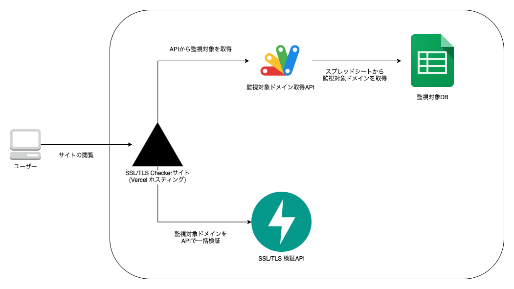

# SSL/TLS非対応を追う

※以降、SSL/TLS を SSL と表記します

仲のいいラップグループ chelmicoの[オフィシャルサイト](http://chelmico.com/)がSSL非対応であることをからかったりしているうちに、気がついたらミュージシャンやアーティストのサイトでSSLになっていないホームページを面白がって報告しあうようになった。

更に調子が出てきて、[ピスタチオスタジオゲーム部のDiscordサーバー](https://discord.com/pistachiogaming)でNOT SSLを監視する仕組みづくり始まり、出来上がったのがこれ。

[https://ssl-checker.vercel.app/](https://ssl-checker.vercel.app/)

## 使い方

1. ピスタチオゲーム部のDiscordサーバーからしか登録は出来ません。
1. チャット欄で`!!addssl <登録したいURL>`のコマンドを打つ。

1. 自作のBot[タコ八](https://github.com/pistachiostudio/takohachi)がデータベースとして使用してるGoogle Spreadsheet(以下GSP)に登録し、監視を開始します。

## これまでの華々しい実績

- ネットレーベル [Trekkie TraxのHP](https://www.trekkie-trax.com/)をSSL対応へと導いた
- ミュージシャン [in the blue shirtsのHP](https://intheblueshirt.com/)をSSL対応へと導いた
- アーティスト [exonemoのHP](https://exonemo.com/)をSSL対応へと導いた
  - ※ただしexonemoはhttp→httpsへのリダイレクト設定がされていない。なんとかしたい。

詳細: [https://twitter.com/Arimuri/status/1437340336540426241](https://twitter.com/Arimuri/status/1437340336540426241)

## かんたんな仕組みの説明

### データベースへの登録部分

[@助六弁当(こやま)](https://twitter.com/quojama)が担当。
データベースへの登録部分はDiscordのBotで行っています。コードは[ここ](https://github.com/pistachiostudio/takohachi/blob/master/cogs/addssl.py)。

1. Discordのチャット欄で`!!addssl <URL>`コマンドを入力。Botが発動
2. 引数<URL>がURLじゃない場合は弾く
3. 登録ウェブサイトのタイトルを取る
4. GSPにアクセスする諸々を行う
5. URLからドメイン部分を抽出
6. 抽出したドメインが既に登録されていないかチェック。登録されている場合は処理を中止
7. GSPのA列にタイトル、B列に元の登録URL、C列にドメイン部分を格納
8. Discordに完了のリアクションとメッセージを送る

 こやまの担当部分はここまで。ここから先は[@tkm(たくみ)](https://twitter.com/tsurutaaaaaa_)にバトンタッチする

データベースはこんな感じのただのGSP。NOT OK牧場とのこと。戦略的非対応を汲み取るコメントも。

### データベースからのSSL検証部分

[@tkm(たくみ)](https://twitter.com/tsurutaaaaaa_)が担当。この部分はたくみが書きます。

[SSL検証サイト](https://ssl-checker.vercel.app/)は以下のような構成になっています。

各ソースコードはここ
- [SSL/TLS Checker (サイト)](https://github.com/zztkm/ssl-checker/tree/main/frontend)
- [監視対象ドメイン取得API](https://github.com/zztkm/ssl-checker/tree/main/api)
- [SSL/TLS検証API](https://github.com/zztkm/SSLCheckAPI)

処理の流れ

1. 監視対象ドメイン取得APIからデータを監視対象を取得
1. SSL/TLS検証APIで一括検証
1. 検証結果をサイトに反映
    - 毎日AM9:00頃に検証結果を更新しています

## 今後のアップデート予定

- [ ] スプレッドシートA列の`タイトル`をサイトに表示させる
- [ ] リダイレクトの設定がされているかの判定をする
- [ ] データベースへの書き込み前にSSLとリダイレクトの判定をかまし、どちらもクリアしているドメインに関しては登録しないなどの対応をする

## ご対応のお願い
SSL(Secure Socket Layer)とは平たく言うとURLが`http://~`ではなく、`https://~`となっているかということ。この"s"はSecureの"s"。

専門家ではないので詳しいことはわからないけど、とにかくSSLになっていないとGoogle Chromeのアドレスバーにすごい嫌な文字が表示される。嫌だ。

この嫌な文字を見ないためだけにでも、皆様におかれましては是非対応をお願いいたします。

対応方法は非常に簡単な場合が多く、自身が契約しているドメインの管理画面からボタン一つでできることがほとんどです。専門的な知識も何もいりません
- [さくらインターネット](https://help.sakura.ad.jp/360000223521/)
- [お名前.com](https://www.onamae-server.com/guide/rs/p/11)
- [ムームードメイン](https://support.lolipop.jp/hc/ja/articles/360049142793)
- [Xserver](https://www.xserver.ne.jp/manual/man_server_ssl.php)
- [StarDomain](https://www.star.ne.jp/manual/guide_ssl_free.php)

この時必ずリダイレクトの設定も忘れずに行ってください！一見https対応されていないと思われ、確認したところhttps対応されているがリダイレクトされていないため、httpとhttpsが両方存在しているような状態になっているケースが散見されました。

サポートが必要な場合は気軽にDiscordで質問してください！

## お誘い

こんな感じでよくわからないものを作って遊んでいます。もし一緒に遊んでくれるおられましたらぜひお声がけください。
